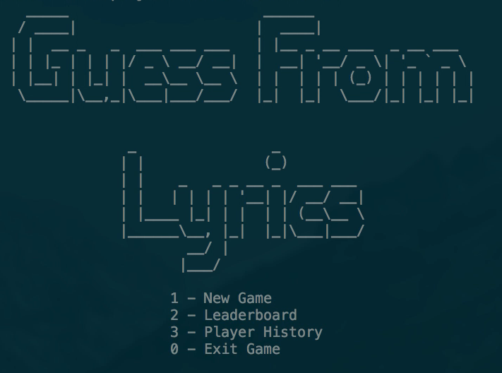
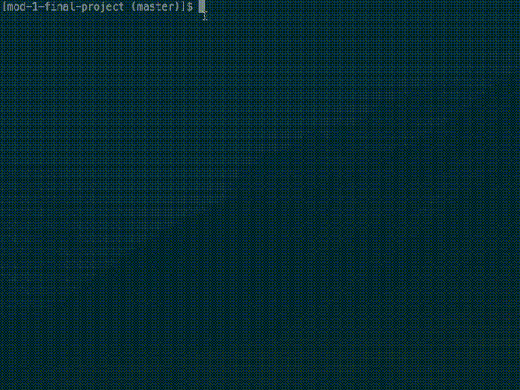

# Guess from Lyrics Game



Guess from Lyrics is a Ruby-based CLI game where players guess the artist from the supplied lyrics.

To get started playing, first clone this repository, bundle install dependencies, and then run!

## Installation
#### OSX/Linux
```
git clone git@github.com:Shaundra/mod-1-final-project.git
cd mod-1-final-project
bundle install
rake run
```

#### Windows
Install Ruby and Rails via [Rails installer](http://railsinstaller.org) then run the above commands.

## License
This game makes use of the open-source music database project [MusicDemons](https://musicdemons.com/api), and [ASCII Art API](https://artii.herokuapp.com/).

### Demo


### Next steps for Guess From Lyrics:
- [ ] Adding additional game modes
  - select genres and/or decades for a game
  - reverse play (guess which lyrics belong to an artist)
- [ ] Hints (allow a player to request two more lines of lyrics)
- [ ] Exploratory analytics
  - allow a player to learn about the songs collection
